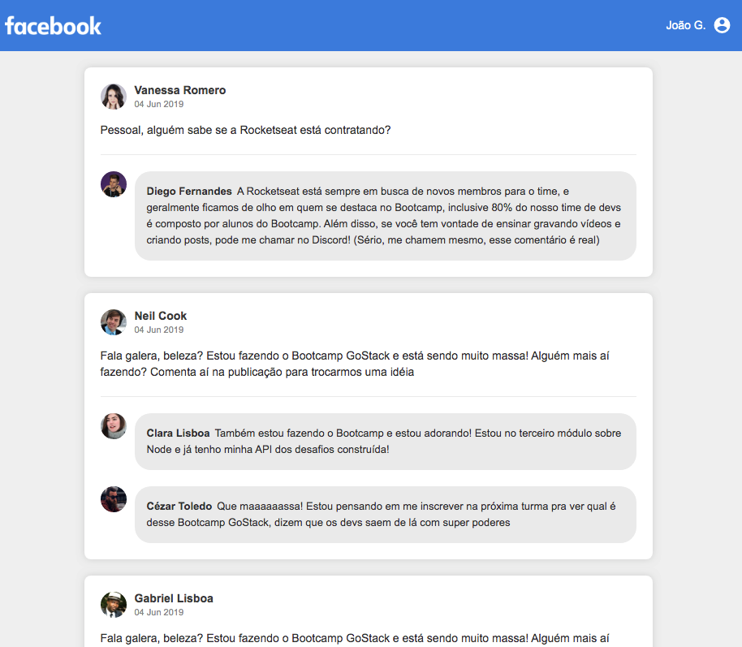

<p align="center">
  
</p>

---

<p align="center">
  <a href="#page_with_curl-descricao">Descrição</a>&nbsp;&nbsp;&nbsp;|&nbsp;&nbsp;&nbsp;
  <a href="#information_source-como-usar">Como usar</a>&nbsp;&nbsp;&nbsp;|&nbsp;&nbsp;&nbsp;
  <a href="#blue_book-references">Referências</a>&nbsp;&nbsp;&nbsp;|&nbsp;&nbsp;&nbsp;
</p>



## :page_with_curl: Descrição

Este projeto foi desenvolvido com base na descrição do quarto desafio do campo de inicialização do GoStack.

#### :rocket: Tecnologias

- HTML/CSS
- ReactJS
- Babel
- Webpack

## :information_source: Como usar

```bash
$ git clone https://github.com/SnakeJoao/bootcamp-gostack-desafio-04

$ cd bootcamp-gostack-desafio-04

$ yarn

$ yarn dev
```

#### Note: Você deve ter instalado o gerenciador de pacotes [Yarn](https://yarnpkg.com/) globalmente.

## :blue_book: Referências

- [Rocketseat](https://docs.rocketseat.dev/)
- [ReactJS Docs](https://reactjs.org/)
